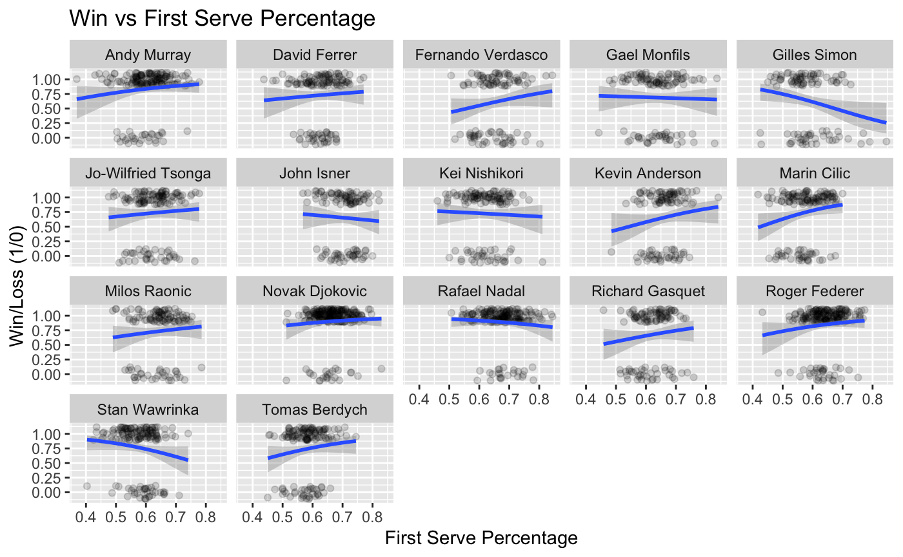
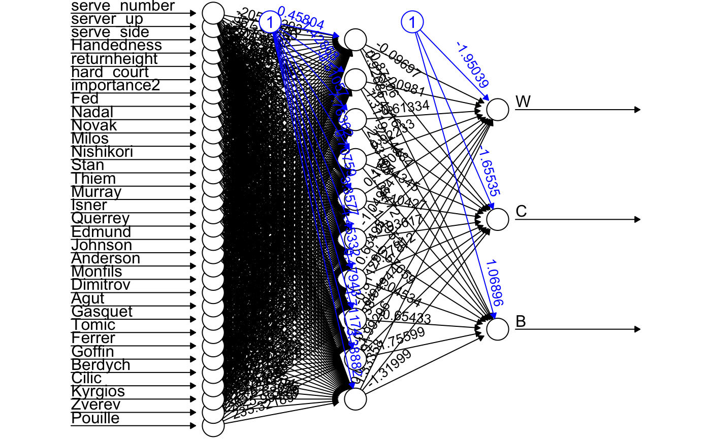

```{r setup, include=FALSE}

knitr::opts_chunk$set(echo = FALSE)
```

## Introduction

* Purpose: An attempt to characterize the importance of the serve for specific players in professional tennis and predict the serve based on point importance
* Motivation: It seems like there is a lack of valuable comments on the serve in professional tennis
* The data used includes match level and point level data (from <https://github.com/JeffSackmann>)
    + Also used point importance data (from Stephanie Kovalchik's `deuce` `R` package)

## Model Building

* Bradley-Terry model (match data)
    + A paired competetion model based on "ability" that returns predicted match win probability
<!-- mention that this will be the main focus  -->
* Mixed effects model (point data)
    + This model showed that while point importance is significant, its role is too small to influence serve prediction (performed similarly to model without point importance)
* Neural network (point data)
    + Used player indicators, side of the court, whether the server was leading in the game, and several other indicators as predictors for the categorical response serve location (from Fritsch et al. `neuralnet` `R` package)

## Model attempt before Bradley-Terry model

* Before deciding on a Bradley-Terry model we looked at logistic regression
* It was possible for players to have overall downward slope against all opponents but have all upward slopes against each individual opponent

```{r, out.width = "600px"}

```

## Bradley-Terry Model

 $$log(\frac{P_{ij}}{1 - P_{ij}}) = (\alpha_{i} + \beta_{i} * firstserve_i) - (\alpha_{j} + \beta_{j} * firstserve_j)$$
 

## App

* Built with Shiny in R
* App lets user select player of interest and any number of opponents and plots predicted match win probability with predictor first serve percentage
* Most players have positive relationships between first serve percentage and predicted match win probability
    + Surprisingly some have negative relationships
    + We suspect this may be due to different serve strategies' success
* <https://jdmarv17.shinyapps.io/tennis_app/>

## Neural Network

* The neural network performed about 5% better than basic proportion model (45-47% compared to 50-52% successful)
    + across 8000 data points this is a difference of 400 correct predictions

```{r, out.width = "600px"}

```

## Next steps

* Trying new neural network packages that reduce training time
    + training time was a limiting factor
* Try to find evidence for why certain players have downward trending lines for our Bradley-Terry
* New variables for BT (second serve, serve speed, etc.)

## Sources

* Fritsch, Stefan & Guenther, Frauke & Wright, Marvin N. (2019). `neuralnet`: Training of Neural Networks. `R` package version 1.44.2. https://CRAN.R-project.org/package=neuralnet

* Kovalchik, Stephanie (2019). `deuce`: Resources for Analysis of Professional Tennis Data. `R` package version 1.3

* Sackmann, Jeff. tennis_wta, (2020), GitHub Repository, https://github.com/JeffSackmann/tennis_wta 

* Sackmann, Jeff. tennis_slam_pointbypoint, (2020), GitHub Repository, https://github.com/JeffSackmann/tennis_slam_pointbypoint