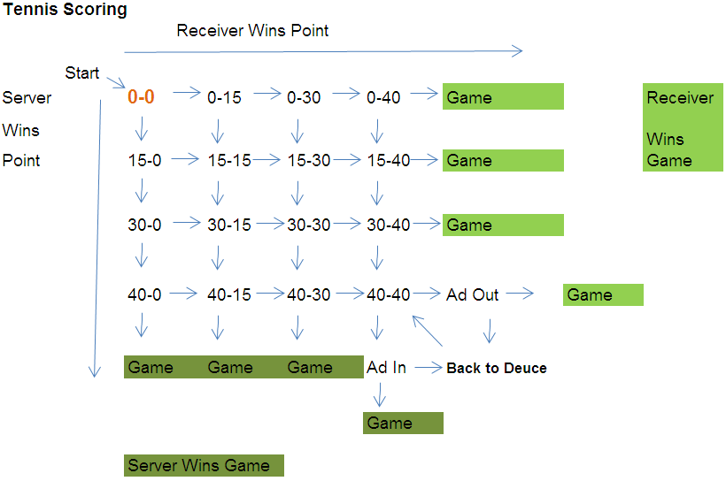

```{r setup, include=FALSE}
knitr::opts_chunk$set(echo = FALSE)
```


## Tennis Scoring for Games

* The first point a player wins brings their point score to 15  
* Second point brings point score to 30  
* Third point brings point score to 40  
* Winning a fourth point concludes the game as long as the other player doesn't have a point score of 40 as well  
* 40-40 is referred to as deuce  
* At deuce the next point won brings the score to Ad-40  
* If the player who won the point at deuce wins the next point the game is over  
* If the other player wins the point the score returns to deuce  
* examples of scores: 0-15, 30-15, 40-30, 40-Ad, 30-30

## Scoring Graphic


```{r, out.width = "700px"}

```


## Tennis Scoring for Matches

* A match is won by winning either 2 sets (out of 3) or 3 sets (out of 5) depending on the tournament  
* The first to 6 games (win by 2) wins the set  
* If the score gets to 6-6 in a set a first to 7 point tiebreaker (win by 2) is played to determine the winner of the set  
* The only exception to the tiebreaker is at specific tournaments the last set will continue with games being played until one player leads by 2 games

## Goal of the Project

* Be able to characterize how important the serve is in determining the outcome of a match for a group of professional tennis players
* Analyze how players' serves are effected by the importance of the point being played

## Part 1: Serve Importance

<!-- spacing of the sub-bullets in presentations is VERY picky. Need to be four spaces out exactly -->
* Creating logistic regression models to model individual professional tennis players' probability of winning a match as a function of different serve characteristics
    + Serve characteristics looked at will include first serve percentage, second serve percentage, average serve speed
    + Court surface will be included as a predictor since different surfaces react differently to speed and spin on the serve
  

## Part 2: Point Importance Impact on Serve

* Using point importance data combined with point by point data from the past decade of Grand Slam tennis matches to analyze the effect a point's importance has on a player's serve
    + Point by point data is from Jeff Sackmann's GitHub which has point and match data for all matches for the last decade (https://github.com/JeffSackmann/tennis_atp)
    + Point importance data is from Stephanie Kovalchik's GitHub (https://github.com/skoval/deuce)


## Point Importance
* First calculated in a paper by O'Donoghue, P. G. (2001) and put into an `R` data set by Stephanie Kovalchik
* Because of the unique scoring system, certain points are more important than others
* Given a specific point, by looking at all matches' outcomes that reached that score Kovalchik is able to assign a relative importance value to winning that point
* A good example of relative importance is comparing the first point in a tennis match to a point at 2 sets - 2 sets, 5-5, 40-40
  <!-- can just say this part to make the slide a little less text heavy. Also probably want to mention the reason why: two equally matched players still have about a 50/50 shot at winning the match no matter who wins the first point. But, the player who wins the 2 sets 5-5 deuce point has a much higher chance at taking the match.
  + The first point is not very important in determining the outcome of a match so clearly the latter point would be much more important -->

## Using Point Importance

* My second goal for the project is to see 
    - how big of an influence a point's importance has on the serve speed and placement for first and second serves 
    - if these associations tend to be different for different players on tour
* <!-- Depending on the magnitude of the effect I will also try to  --> build a model to predict a serve speed and placement given a serving player and a current score in a match

## Challenges

* Manipulating large data sets into useable form
* Ensuring the importance data is properly merged with point data
* Dealing with missing data


