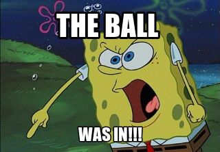

<!-- can mess around with the default themes: Default, Sky, Beige, Simple, Serif, Night, Moon, Solarized -->

<!-- can also mess around with transitions: None, Default, Page, Concave, Fade, Linear, Zoom -->

<!-- See number 5 for markup options: https://rstudio.com/wp-content/uploads/2015/02/rmarkdown-cheatsheet.pdf -->

```{r setup, include=FALSE}
## not sure if you talked about these markdown chunk optionsin STAT 213 or not....if not, we can talk more about them....
## this chunk is where you set them globally...
## these won't be super important for an introductory presentation anyway,
## since there won't be that much, or maybe even any, r code and results.
knitr::opts_chunk$set(echo = FALSE)
```

## R Markdown

This is an R Markdown presentation. Markdown is a simple formatting syntax for authoring HTML, PDF, and MS Word documents. For more details on using R Markdown see <http://rmarkdown.rstudio.com>.

When you click the **Knit** button a document will be generated that includes both content as well as the output of any embedded R code chunks within the document.

## Slide with Bullets

- Bullet 1
- Bullet 2
- Bullet 3

## Slide with R Output

```{r cars, echo = TRUE} 
## and can change the global options by changing stuff in the markdown chunks
## specifically....like having echo = TRUE allows the code to show.
summary(cars)
```

## Slide with Plot

```{r pressure}
plot(pressure)
```

## Including Images

Can include images directly using some html code or can insert an R chunk and have a package put in an image for you.

{width=400px}

```{r, out.width = "700px"}

```

